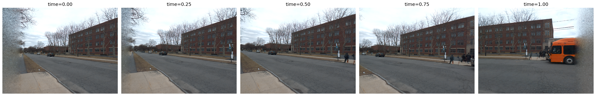
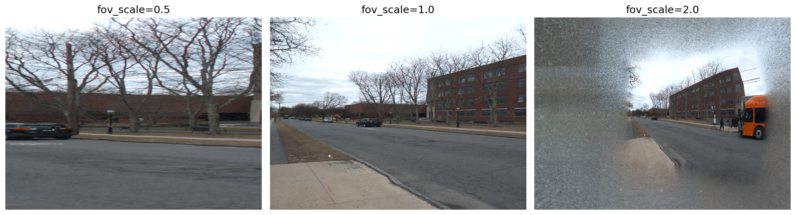
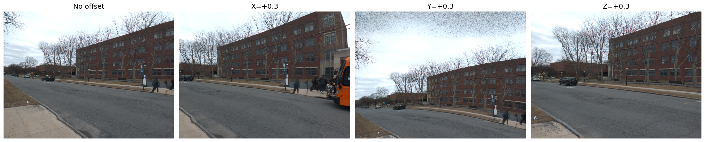
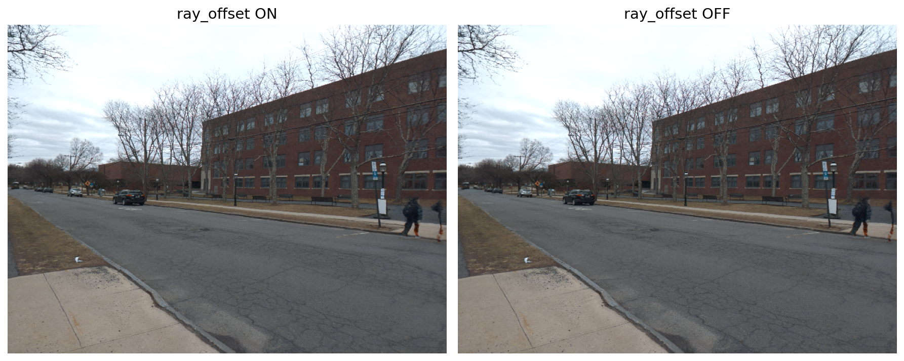
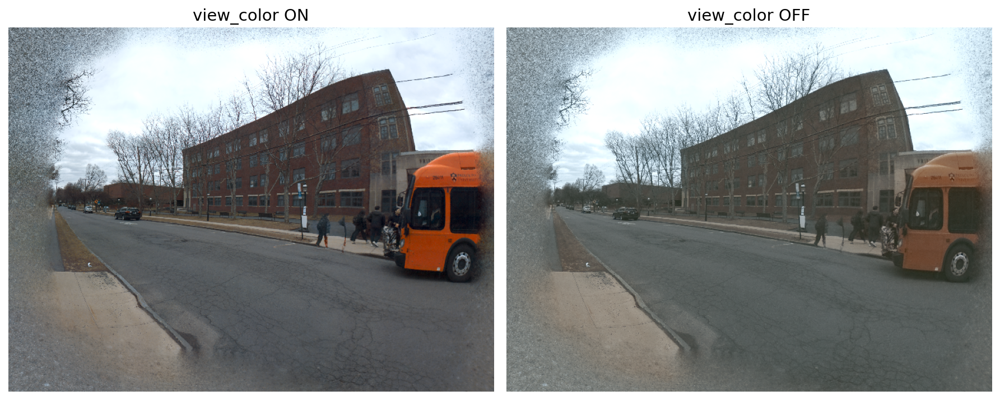
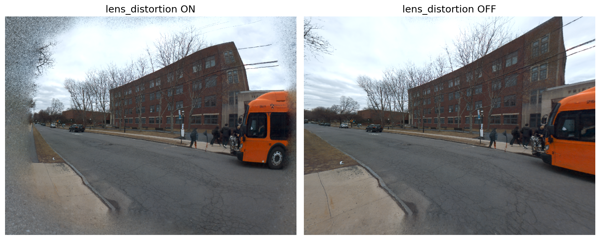
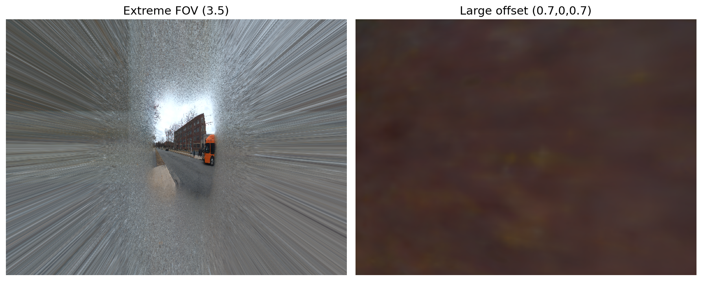

# Assignment 4: Neural Light Sphere (NLS)

> Name: Yixun Hu
> NetID: yh4742

I used TA's data to train the model. Data from classmate caused OOM error on my machine, and the scan folder is `processed_2025_03_06_15_45_13-temp4`.

## 1. Implementation Description

I implemented four core components in `train.py`:

### 1.1 Unit Sphere Intersection (`solve_sphere_crossings`)

Given rays originating inside a unit sphere, I solve the quadratic equation $|o + td|^2 = 1$ for $t$:

$$a = |d|^2, \quad b = 2(o \cdot d), \quad c = |o|^2 - 1$$
$$t = \frac{-b + \sqrt{b^2 - 4ac}}{2a}$$

We take the far (positive) root since ray origins are inside the sphere ($|o| < 1$). The intersection point is then $p = o + td$.

### 1.2 TCNN Encodings (`inference` and `forward`)

The TCNN hash grid encodings require inputs in $[0, 1]$. Since sphere intersection points lie on the unit sphere with coordinates in $[-1, 1]$, I map them via $(x \cdot 0.5 + 0.5)$:

- **Offset position encoding**: `encoding_offset_position(intersections_sphere * 0.5 + 0.5)` — encodes the 3D sphere intersection for the ray offset network.
- **Offset angle encoding**: `encoding_offset_angle(uv)` — encodes the 2D image coordinate (already in $[0, 1]$).
- **Color position encoding**: `encoding_color_position(intersections_sphere_offset * 0.5 + 0.5)` — encodes the offset-adjusted intersection for the color network.
- **Color angle encoding**: `encoding_color_angle(uv)` — encodes view direction via image coordinates.

In `forward()`, each encoding is additionally wrapped with `self.mask(...)` for progressive training, gradually enabling higher-frequency features as training progresses.

### 1.3 Lens Distortion (`generate_ray_directions`)

I implemented the standard OpenCV radial-tangential distortion model. Given coefficients $k_1, k_2, k_3$ (radial) and $p_1, p_2$ (tangential):

$$x' = x(1 + k_1 r^2 + k_2 r^4 + k_3 r^6) + 2p_1 xy + p_2(r^2 + 2x^2)$$
$$y' = y(1 + k_1 r^2 + k_2 r^4 + k_3 r^6) + p_1(r^2 + 2y^2) + 2p_2 xy$$

where $r^2 = x^2 + y^2$. This corrects for the phone camera's physical lens distortion when generating ray directions.

---

## 2. Representative Renderings

### 2.1 Varying Time

The `time` parameter interpolates between frames captured during the phone sweep ($t=0$: first frame, $t=1$: last frame). Each frame corresponds to a different camera orientation along the sweep trajectory.

As time progresses, the rendered viewpoint smoothly sweeps across the captured scene, demonstrating the model's ability to interpolate between discrete captured frames.

### 2.2 Varying FOV Scale

The `fov_scale` parameter scales the horizontal field of view, simulating a wider-angle lens.

At `fov_scale=1.0`, the render matches the original camera FOV. As `fov_scale` increases to 2.0–2.5, the render reveals a much wider view of the scene — effectively turning the captured data into an ultra-wide or fisheye-like panorama.

### 2.3 Varying Offsets

Camera position offsets translate the virtual camera origin along X, Y, or Z axes within the unit sphere.

Moving the camera origin causes parallax-like shifts in the rendered perspective. The X and Y offsets shift the view horizontally/vertically, while Z offset moves the camera forward/backward relative to the scene sphere.

---

## 3. Why Use a Spherical Model?

A spherical representation is natural for panoramic stitching for several reasons:

1. **Uniform angular coverage**: A sphere maps every direction from a central viewpoint uniformly. Unlike planar projections (which distort at wide angles), a sphere can represent a full $4\pi$ steradians of directions without singularities or excessive distortion.

2. **Rotation invariance**: Camera rotation during a phone sweep corresponds to simply indexing different points on the sphere surface. The sphere decouples rotation from translation, making it straightforward to compose multiple frames captured at different orientations.

3. **Compact, bounded domain**: The unit sphere provides a naturally bounded $[−1, 1]^3$ domain that maps cleanly to the $[0, 1]^3$ input range required by hash grid encodings (TCNN). This avoids the unbounded coordinates that would arise with a planar or volumetric representation.

4. **No depth ambiguity**: Unlike NeRF-style volumetric models that must reason about density along rays, the light sphere is a 2D surface — each ray maps to exactly one intersection point, making it computationally efficient for the panoramic use case where the scene is distant relative to camera motion.

---

## 4. Why Does Two-Stage Training Help Convergence?

The NLS model uses progressive/masked training controlled by `training_phase` (0 → 1):

1. **Early stage (phase < 0.2)**: Only coarse translation and low-frequency color features are active. The offset network is disabled. Random perturbations are added to ray origins to prevent overfitting to exact camera positions. This lets the model first learn the coarse spatial layout and average colors.

2. **Later stage (phase > 0.2)**: The ray offset network, view-dependent color, and higher-frequency encoding features are progressively unmasked. The `mask()` function gradually reveals more encoding dimensions as training progresses.

This coarse-to-fine strategy helps because:

- **Avoids local minima**: If all high-frequency features were enabled from the start, the model could overfit to noise or get stuck in poor local minima before learning the correct global structure.
- **Stable optimization**: Low-frequency components are easier to optimize and provide a good initialization for higher-frequency refinement.
- **Decoupled learning**: Camera pose correction (translation/rotation) is learned first with a smooth loss landscape, then fine scene details and view-dependent effects are layered on top.

---

## 5. Toggle Comparisons

All comparisons below are rendered at `time=0.5`, `fov_scale=1.5`, with default offsets.

### 5.1 Ray Offset (ON vs OFF)

**Difference**: With ray offset ON, the model applies a learned per-ray angular correction that compensates for misalignment between frames. Turning it OFF removes this correction, which can cause subtle ghosting or blurring at object boundaries where frames don't perfectly align. The ray offset acts as a spatially-varying deformation that improves sharpness.

### 5.2 View-Dependent Color (ON vs OFF)

**Difference**: With view-dependent color ON, the model can represent appearance changes based on viewing angle (e.g., specular highlights, reflections, auto-exposure variations between frames). Turning it OFF forces a single color per sphere direction regardless of viewing angle, which can result in averaged/washed-out colors where the scene appearance varied across captured frames.

### 5.3 Lens Distortion (ON vs OFF)

**Difference**: With lens distortion ON, rays are corrected for the camera's radial and tangential distortion before being projected. Turning it OFF causes misaligned ray directions, especially toward image edges, leading to geometric warping artifacts — straight lines may appear curved, and edge regions may look stretched or compressed.

---

## 6. Where Does Rendering Break Down?

### Observed Failure Cases

1. **Extreme FOV (fov_scale > 3.0)**: At very wide fields of view, the model is asked to render directions that were never observed during the phone sweep. The sphere surface in these unobserved regions produces blurry, repetitive, or color-shifted artifacts because the neural field was never supervised there.

2. **Temporal boundaries (t=0.0 and t=1.0)**: At the very start and end of the captured sequence, only one neighboring frame is available for interpolation. The model has less multi-view supervision at these extremes, leading to reduced quality and potential ghosting.

3. **Large camera offsets**: Moving the virtual camera origin far from where training data was captured forces the model to extrapolate parallax effects it was never trained on. Since the light sphere is fundamentally a 2D surface (no true 3D geometry), it cannot correctly render novel parallax for nearby objects.

### Why This Happens

The neural light sphere maps rays to colors on a fixed spherical surface. It works well within the observed distribution of camera poses and directions, but has no mechanism for true 3D geometric reasoning. When asked to render from significantly different viewpoints or at extreme angles, it must extrapolate from its 2D representation, which inherently cannot capture view-dependent parallax for objects at different depths.
